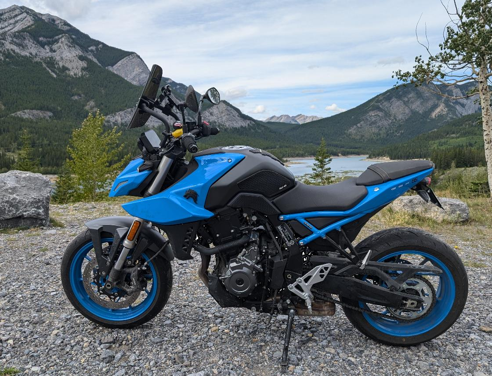
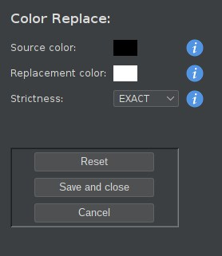
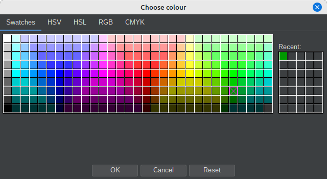
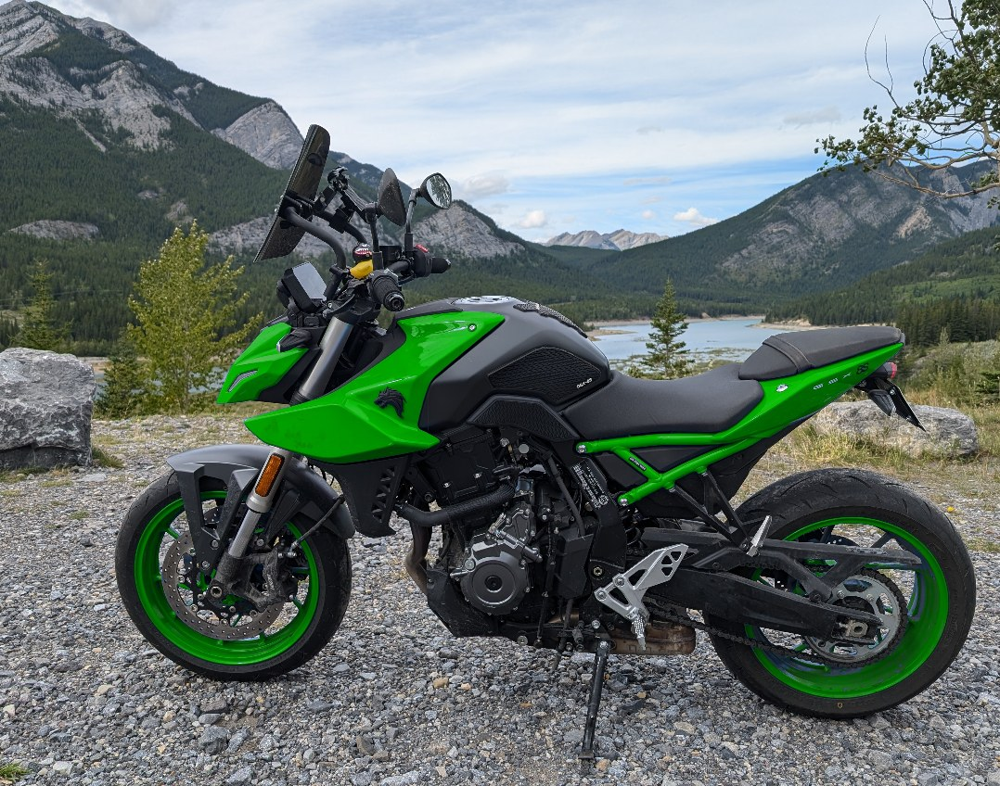
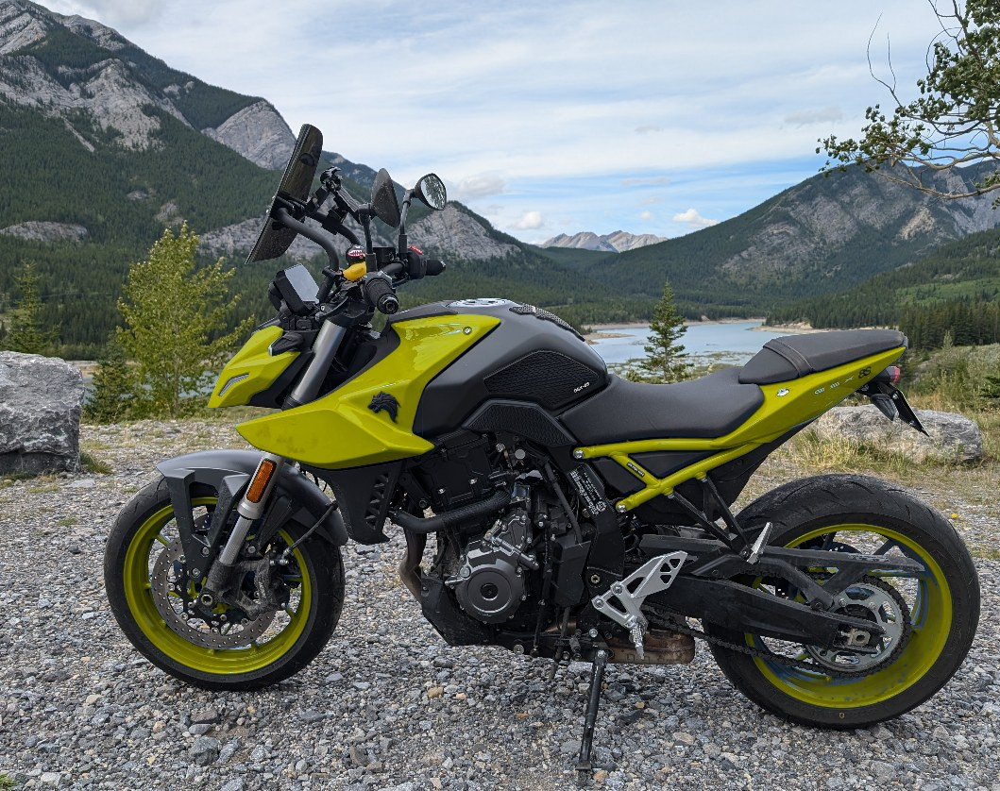
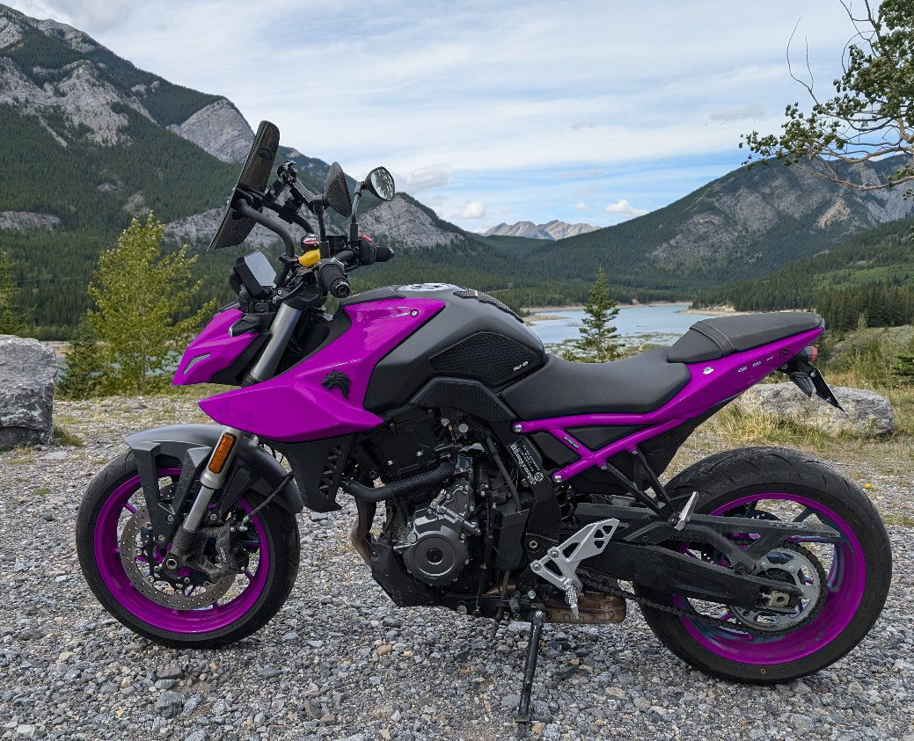

# ext-iv-color-replace

## What is this?

This is an extension for the [ImageViewer](https://github.com/scorbo2/imageviewer) application that allows you to
change colors in an image intelligently. Select a color in the image (or choose
one manually), then select a replacement color. Choose the match threshold
to use, and the selected color in the image will be replaced in a live preview panel.
You can then save the result or discard it and try again.

This extension works with JPEG and PNG images.

## How do I get it?

### Option 1: automatic download and install

Visit the "Available" tab in the extension manager dialog. Select "Color replace" from the list on the
left and then hit the "Install" button in the top right.
If you decide later to remove the extension, come back to the extension manager dialog, select "Color replace"
from the list on the left, and hit the "Uninstall" button in the top right. The application will prompt to restart.
It's just that easy!

### Option 2: manual download and install

You can manually download the extension jar:
[ext-iv-color-replace-3.3.1.jar](https://www.corbett.ca/apps/ImageViewer/extensions/3.3/ext-iv-color-replace-3.3.1.jar)

Save it to your ~/.ImageViewer/extensions directory and restart the application.

### Option 3: build from source

You can clone this repo and build the extension jar with Maven (Java 25 or higher required):

```shell
git clone https://github.com/scorbo2/ext-iv-color-replace.git
cd ext-iv-color-replace

# Note: you must have built ImageViewer and
# installed it in your local Maven repo in order
# for this step to work. See the ImageViewer 
# README for instructions.
mvn clean package

# Copy the result to extensions dir:
cp target/ext-iv-color-replace-3.3.1.jar ~/.ImageViewer/extensions/
```

## Okay, it's installed, now how do I use it?

1. Open a JPEG or PNG image in ImageViewer.
2. Launch the dialog via **Edit &gt; Color replace...** (or right-click the
   image in the thumbnail/file panels, or press the configurable
   `Ctrl+Shift+R` shortcut).
3. **Pick the color to replace** - either left click anywhere on the image
   preview, or click the "Source color" field and choose from the popup color
   chooser.
4. **Pick the replacement color** - either right click anywhere on the image
   preview, or use the "Replacement color" field.
5. **Choose the strictness level** that controls how closely a pixel must
   resemble the source color to be replaced:

   | Level  | Behavior |
   |--------|----------|
   | EXACT  | Only pixels with the exact source color value (great for 8-bit pixel art). |
   | STRICT | Pixels very close to the source color. Safest for photographs. |
   | MEDIUM | Moderately close pixels, including most shades of the source color. |
   | LOOSE  | Somewhat close pixels - reaches for dark and washed-out shades. Most aggressive. |

   The preview updates live as you change any option.
 6. **Save and close** overwrites the original image file with the result.
    **Save As...** saves the result to a different file of your choice, leaving
    the original image untouched (you'll be prompted to confirm if the target
    file already exists, and if you omit the file extension, the image is
    saved as PNG). The dialog remembers the last directory you saved to,
    so the next "Save As..." starts there. **Cancel** (or press ESC) discards
    the edit. Pressing Enter prompts you to save and close.

### Examples

We'll start with an image of my motorcycle, which is blue:



From the ImageViewer main window, with this image selected, we can either choose
"Color Replace" from the "Edit" menu, or right-click the image and choose "Color Replace" from the context menu.
or hit "ctrl+shift+r" (the default shortcut, which can be changed in the preferences).
This brings up the color replace dialog, where we see the original image with a control
panel on the left side of the dialog:



We can select the source color (the color to be replaced) by left-clicking anywhere on the image,
or by clicking the "Source color" field and picking a color from the popup color chooser:



Let's click somewhere on the blue parts of the motorcycle. Next, we can select the replacement
color by right-clicking anywhere on the image, or clicking the "Replacement color" field and picking
a color from the popup color chooser. We can then select the "Strictness" setting to use.
"Medium" or "Loose" tend to work best, but it will depend on the image in question, and what
color you are trying to replace. Experiment until you find good results. Here are some
examples of applying different colors to our motorcycle image:





### How the replacement works

The replacement is done intelligently in HSB (hue / saturation / brightness)
space: not just the picked color, but *shades of it* are translated into
shades of the replacement color. A dark shadow in a red car becomes a dark
shadow in a blue car, and a bright washed-out highlight becomes a bright,
pale version of the target color - instead of one flat splotch of the target
color. The stricter the level, the tighter the range of shades that are
touched.

One known limitation to be aware of: when the *source* color is gray, black or
white, only brightness can be used to decide what to replace, so expect LOOSE
replacements of achromatic colors to be aggressive.

## Notes

Color replacement is currently only supported for jpeg and png images.

## Requirements

Compatible with any ImageViewer 3.x release.

## License

ImageViewer and this extension are made available under the MIT license: https://opensource.org/license/mit
